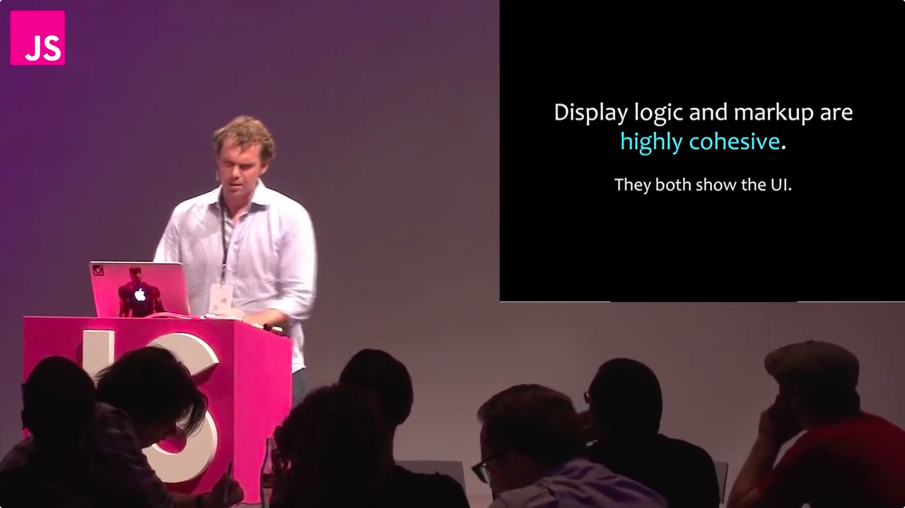

name: cover
class: center, middle, s-inverse, l-cover
layout: true

---

name: intro
tempalte: cover

# Build High Performance UIs<br />with Facebook's React

## Chris Aquino, Big Nerd Ranch

???
# etc. (*coffee, bourbon, cats, bacon, sushi*)

---
name: bnr-logo
class: center, middle
layout: false


???
# Big Nerd Ranch

---
name: bnr-website
class:
layout: false

# Training *and* App Development


???
# Two very different roles
* training
* app development for consulting

# Always
* evaluating new
  * tools
  * libraries
  * frameworks
* looking ahead


---

name: and-then-react
template: cover

# React

---

name: what-it-is

# "A JavaScript Library for Building User Interfaces"

--

* Not a framework

--

* V in MVC

--

* UI Components

--

* [demo](/birthday)

???
# What does all of that mean?

Let's take a look at some code

---


name: countdown
class: small-code

# Birthday countdown example

```html
<!DOCTYPE html>
<html>
  <head>


  </head>
  <body>


  </body>
</html>
```

---


name: countdown
class: small-code

# Birthday countdown example

```html
<!DOCTYPE html>
<html>
  <head>
    <script src="../build/react.js"></script>
    <script src="../build/JSXTransformer.js"></script>
  </head>
  <body>


  </body>
</html>
```


---

name: countdown
class: small-code

# Birthday countdown example

```html
<!DOCTYPE html>
<html>
  <head>
    <script src="../build/react.js"></script>
    <script src="../build/JSXTransformer.js"></script>
  </head>
  <body>

    <script type="text/jsx">
      var ExampleApplication = React.createClass({
        render: function() {
          var elapsed = Math.round(this.props.elapsed  / 100);
          var seconds = elapsed / 10 + (elapsed % 10 ? '' : '.0' );
          var message = 'Hooray! Another year in ' + seconds + ' seconds.';
          return React.DOM.h1(null, message);
        }
      });
      var bday = new Date("April 18, 2014 08:12:00");
      setInterval(function() {
        React.renderComponent(
          ExampleApplication({elapsed: bday.getTime() - new Date().getTime()}),
          document.getElementById('container')
        );
      }, 50);
      </script>
  </body>
</html>
```


---


name: countdown
class: small-code

# Birthday countdown example

```html
<!DOCTYPE html>
<html>
  <head>
    <script src="../build/react.js"></script>
    <script src="../build/JSXTransformer.js"></script>
  </head>
  <body>
    <div id="container"></div>
    <script type="text/jsx">
      var ExampleApplication = React.createClass({
        render: function() {
          var elapsed = Math.round(this.props.elapsed  / 100);
          var seconds = elapsed / 10 + (elapsed % 10 ? '' : '.0' );
          var message = 'Hooray! Another year in ' + seconds + ' seconds.';
          return React.DOM.h1(null, message);
        }
      });
      var bday = new Date("April 18, 2014 08:12:00");
      setInterval(function() {
        React.renderComponent(
          ExampleApplication({elapsed: bday.getTime() - new Date().getTime()}),
          document.getElementById('container')
        );
      }, 50);
      </script>
  </body>
</html>
```
[demo](/birthday)

---


name: countdown

# The script tag

```html
    <script type="text/jsx">
      var ExampleApplication = React.createClass({
        render: function() {
          return React.DOM.h1(null, "");
        }
      });
      React.renderComponent(
        ExampleApplication(),
        document.getElementById('container')
      );
    </script>
```
???

---

name: components
template: cover

# Components

---

# React components

```js
  var MyComponent = React.createClass({


  });
```
---

# React components

```js
  var MyComponent = React.createClass({
    render: function() {

    }
  });
```

---
# React components

```js
  var MyComponent = React.createClass({
    render: function() {
      return React.DOM.h1(null, "Ni hao, react");
    }
  });
```

---
# React components

```js
  var MyComponent = React.createClass({
    render: function() {
      return React.DOM.h1(null, "Ni hao, react");
    }
  });
```
```js
  React.renderComponent(


  );
```

---

# React components

```js
  var MyComponent = React.createClass({
    render: function() {
      return React.DOM.h1(null, "Ni hao, react");
    }
  });
```
```js
  React.renderComponent(
    MyComponent()

  );
```
---
# React components

```js
  var MyComponent = React.createClass({
    render: function() {
      return React.DOM.h1(null, "Ni hao, react");
    }
  });
```
```js
  React.renderComponent(
    MyComponent(),
    document.getElementById('example')
  );
```

---

name: jsx
template: cover

# JSX

---
# React components: JavaScript

```js
  var MyComponent = React.createClass({
    render: function() {
      return React.DOM.h1(null, "Ni hao, react");
    }
  });
```
```js
  React.renderComponent(
    MyComponent(),
    document.getElementById('example')
  );
```

---

# React components: JSX

```js
  var MyComponent = React.createClass({
    render: function() {
      return (<h1>Ni hao, react</h1>);
    }
  });
```
```js
  React.renderComponent(
    <MyComponent />,
    document.getElementById('example')
  );
```

---

name: ni-hao-react
class: small-code

# Ni Hao, React

```html
<!DOCTYPE html>
<html>
  <head>
    <script src="../build/react.js"></script>
    <script src="../build/JSXTransformer.js"></script>
  </head>
  <body>
    <div id="example"></div>
    <script type="text/jsx">
      /** @jsx React.DOM
      */
      var MyComponent = React.createClass({
        render: function() {
          return (<h1>Ni hao, react</h1>);
        }
      });
      React.renderComponent(
        <MyComponent />,
        document.getElementById('example')
      );
    </script>
  </body>
</html>
```
[demo](/ni-hao-react/index.html)

---

# Enabling JSX Transformations

```html
  <script src="../build/react.js"></script>
  <script src="../build/JSXTransformer.js"></script>
```

--

```html
  <script type="text/jsx">
    /** @jsx React.DOM
    */

    // React code goes here
  </script>
```

???

---
name: wait
template: cover

# Wait.
---
name: why
# Code and markup living together?

* Isn't this like yucky PHP?

--

* Shouldn't I be using Handlebars|Mustache|Whatever?

--

* What about separation of concerns?

--

* Will it make my jeans less skinny?


---
name: aside
# An aside

[](video/templates-separate-technologies.mp4)
???

Templates aren't a separation of concerns.
They're a separation of technology.
---
name: not-so-bad

# JSX

--

* embedded XML

--

* transforms to functions

--

* Completely optional.

--

* **not** part of React!
---

# Would you rather write:

```js
var HelloMessage = React.createClass({
  render: function() {
    return (
      React.DOM.div(null,
        React.DOM.h1(null, "Greetings, Professor ", this.props.name,"."),
            React.DOM.p(null,
              "Would you like to play a game?",React.DOM.br(null ),
              "How about a nice game of",
              React.DOM.a( {href:"http://nsa.gov"}, "Chess"),"?"
            )
      )
    );
  }
});

React.renderComponent(HelloMessage( {name:"Professor Falken"} ), mountNode);
```

---
# Or this?

```js
var HelloMessage = React.createClass({
  render: function() {
    return (
      <div>
        <h1>Greetings, Professor {this.props.name}.</h1>
            <p>
              Would you like to play a game?<br />
              How about a nice game of
              <a href="http://nsa.gov">Chess</a>?
            </p>
      </div>
    );
  }
});

React.renderComponent(<HelloMessage name="Professor Falken" />, mountNode);
```

---
# Advantages of JSX

--

* Easier to read

--

* Designer-friendly!

--

* Looks like the output

--

[Live JSX compiler](http://facebook.github.io/react/jsx-compiler.html)
---

name: composition
# Composition
---
name: find-out-more
template: cover


# Find out more about React

---

name: official-website
class:

# facebook.github.io/react
.center[]

---
name: github
class:

# github.com/facebook/react
.center[]

---

name: google-group

# groups.google.com/group/reactjs
.center[]

---

name: bnr-blog

# blog.bignerdranch.com
.center[]


---
name: outro
template: cover

# Thank you!


## Chris Aquino, Big Nerd Ranch

@bignerdranch
