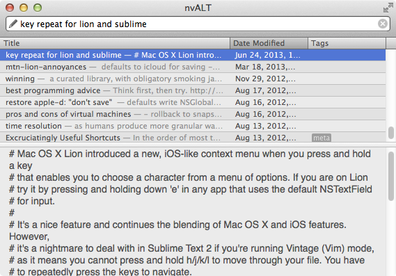

name: cover
class: center, middle, s-inverse, l-cover
layout: true

---

name: intro
tempalte: cover

# Build High Performance UIs<br />with Facebook's React

## Chris Aquino, Big Nerd Ranch

[http://bit.ly/atljs-react-2014](http://bit.ly/atljs-react-2014)

???
# etc. (*coffee, bourbon, cats, bacon, sushi*)

---
name: bnr-logo
class: center, middle
layout: false


???
# Big Nerd Ranch

---
name: bnr-website
class:
layout: false

# Training *and* App Development


???
Two very different roles: training and app development for consulting

Always evaluating new * tools * libraries * frameworks *
And, always looking ahead


---

name: and-then-react
template: cover

# React

---

name: what-it-is

# "A JavaScript Library for Building User Interfaces"

--

* Not a framework

--

* V in MVC

--

* UI Components

--

* [demo](/birthday)

???
# What does all of that mean?

Let's take a look at some code

---


name: countdown
class: small-code

# Birthday countdown example

```html
<!DOCTYPE html>
<html>
  <head>


  </head>
  <body>


  </body>
</html>
```

???
Start with a plain HTML file
---


name: countdown
class: small-code

# Birthday countdown example

```html
<!DOCTYPE html>
<html>
  <head>
    <script src="../build/react.js"></script>
    <script src="../build/JSXTransformer.js"></script>
  </head>
  <body>


  </body>
</html>
```

???
Include React via script tags
---

name: countdown
class: small-code

# Birthday countdown example

```html
<!DOCTYPE html>
<html>
  <head>
    <script src="../build/react.js"></script>
    <script src="../build/JSXTransformer.js"></script>
  </head>
  <body>

    <script>
      var ExampleApplication = React.createClass({
        render: function() {
          var elapsed = Math.round(this.props.elapsed  / 100);
          var seconds = elapsed / 10 + (elapsed % 10 ? '' : '.0' );
          var message = 'Hooray! Another year in ' + seconds + ' seconds.';
          return React.DOM.h1(null, message);
        }
      });
      var bday = new Date("April 18, 2014 08:12:00");
      setInterval(function() {
        React.renderComponent(
          ExampleApplication({elapsed: bday.getTime() - new Date().getTime()}),
          document.getElementById('container')
        );
      }, 50);
      </script>
  </body>
</html>
```
???
Add the script

---


name: countdown
class: small-code

# Birthday countdown example

```html
<!DOCTYPE html>
<html>
  <head>
    <script src="../build/react.js"></script>
    <script src="../build/JSXTransformer.js"></script>
  </head>
  <body>
    <div id="container"></div>
    <script>
      var ExampleApplication = React.createClass({
        render: function() {
          var elapsed = Math.round(this.props.elapsed  / 100);
          var seconds = elapsed / 10 + (elapsed % 10 ? '' : '.0' );
          var message = 'Hooray! Another year in ' + seconds + ' seconds.';
          return React.DOM.h1(null, message);
        }
      });
      var bday = new Date("April 18, 2014 08:12:00");
      setInterval(function() {
        React.renderComponent(
          ExampleApplication({elapsed: bday.getTime() - new Date().getTime()}),
          document.getElementById('container')
        );
      }, 50);
      </script>
  </body>
</html>
```
[demo](/birthday)

???
Add the container to render to

---


name: countdown

# The nitty-gritty

```html
    <script>
      var ExampleApplication = React.createClass({
        render: function() {
          return React.DOM.h1(null, "");
        }
      });
      React.renderComponent(
        ExampleApplication(),
        document.getElementById('container')
      );
    </script>
```
???

---

name: components
template: cover

# Component Basics

---

# React components

```js
  var MyComponent = React.createClass({


  });
```
---

# React components

```js
  var MyComponent = React.createClass({
    render: function() {

    }
  });
```

---
# React components

```js
  var MyComponent = React.createClass({
    render: function() {
      return React.DOM.h1(null, "Ni hao, react");
    }
  });
```

---
# React components

```js
  var MyComponent = React.createClass({
    render: function() {
      return React.DOM.h1(null, "Ni hao, react");
    }
  });
```
```js
  React.renderComponent(


  );
```

---

# React components

```js
  var MyComponent = React.createClass({
    render: function() {
      return React.DOM.h1(null, "Ni hao, react");
    }
  });
```
```js
  React.renderComponent(
    MyComponent()

  );
```
---
# React components

```js
  var MyComponent = React.createClass({
    render: function() {
      return React.DOM.h1(null, "Ni hao, react");
    }
  });
```
```js
  React.renderComponent(
    MyComponent(),
    document.getElementById('example')
  );
```

---

name: jsx
template: cover

# JSX Example

---
# React components: JavaScript

```js
  var MyComponent = React.createClass({
    render: function() {
      return React.DOM.h1(null, "Ni hao, react");
    }
  });
```
```js
  React.renderComponent(
    MyComponent(),
    document.getElementById('example')
  );
```

---

# React components: JSX

```js
  var MyComponent = React.createClass({
    render: function() {
      return (<h1>Ni hao, react</h1>);
    }
  });
```
```js
  React.renderComponent(
    <MyComponent />,
    document.getElementById('example')
  );
```

---
name: wait
template: cover

# Wait.
---
name: why
# Code and markup living together?

* Isn't this like yucky PHP?

--

* Shouldn't I be using Handlebars|Mustache|Whatever?

--

* What about separation of concerns?

--

* Will it make my jeans less skinny?


---
name: aside
# An aside

[](video/templates-separate-technologies.mp4)
???

Templates aren't a separation of concerns.
They're a separation of technology.
---
name: not-so-bad

# JSX

--

* embedded XML

--

* transforms to functions

--

* Completely optional.

--

* **not** part of React!
---

# Would you rather write:

```js
var HelloMessage = React.createClass({
  render: function() {
    return (
      React.DOM.div(null,
        React.DOM.h1(null, "Greetings, Professor ", this.props.name,"."),
            React.DOM.p(null,
              "Would you like to play a game?",React.DOM.br(null ),
              "How about a nice game of",
              React.DOM.a( {href:"http://nsa.gov"}, "Chess"),"?"
            )
      )
    );
  }
});

React.renderComponent(HelloMessage( {name:"Professor Falken"} ), mountNode);
```

---
# Or this?

```js
var HelloMessage = React.createClass({
  render: function() {
    return (
      <div>
        <h1>Greetings, Professor {this.props.name}.</h1>
            <p>
              Would you like to play a game?<br />
              How about a nice game of
              <a href="http://nsa.gov">Chess</a>?
            </p>
      </div>
    );
  }
});

React.renderComponent(<HelloMessage name="Professor Falken" />, mountNode);
```

---
# Advantages of JSX

--

* Easier to read

--

* Designer-friendly!

--

* Looks like the output

--

* Is used throughout these slides

---

name: ni-hao-react
class: small-code

# Ni Hao, React

```html
<!DOCTYPE html>
<html>
  <head>
    <script src="../build/react.js"></script>
    <script src="../build/JSXTransformer.js"></script>
  </head>
  <body>
    <div id="example"></div>
    <script type="text/jsx">
      /** @jsx React.DOM
      */
      var MyComponent = React.createClass({
        render: function() {
          return (<h1>Ni hao, react</h1>);
        }
      });
      React.renderComponent(
        <MyComponent />,
        document.getElementById('example')
      );
    </script>
  </body>
</html>
```
[demo](/ni-hao-react/index.html)

---

# Enabling JSX Transformations

```html
  <script src="../build/react.js"></script>
  <script src="../build/JSXTransformer.js"></script>
```

--

```html
  <script type="text/jsx">
    /** @jsx React.DOM
    */

    // React code goes here
  </script>
```

???

---

# JSX Compiler


[facebook.github.io/react/jsx-compiler.html](http://facebook.github.io/react/jsx-compiler.html)
---

name: composition
template: cover

# Data flow example

---

# Rot13 converter


[demo](/data-flow/complete.html)

???

First, code demo.

Then, the component breakdown.
What components do we need?


---

# Rot13 converter


---

# Rot13 converter

## What components do we need?

--

* Input

--

* Output

--

* App


---
# Rot13 converter

## How will it work?


---
class: small-code
# Start with some HTML

```html
<!DOCTYPE html>
<html>
  <head>
    <script src="../build/react.js"></script>
    <script src="../build/JSXTransformer.js"></script>
  </head>
  <body>
    <div id="container"></div>
    <script type="text/jsx">
      /** @jsx React.DOM */


    </script>
  </body>
</html>
```

---

class: small-code
# Create three components

```html
<!DOCTYPE html>
<html>
  <head>
    <script src="../build/react.js"></script>
    <script src="../build/JSXTransformer.js"></script>
  </head>
  <body>
    <div id="container"></div>
    <script type="text/jsx">
      /** @jsx React.DOM */
      var InputComponent = React.createClass({
          render: function () {
          }
      });

      var OuputComponent = React.createClass({
          render: function () {
          }
      });

      var AppComponent = React.createClass({
          render: function () {
          }
      });
    </script>
  </body>
</html>
```

---
class: small-code
# (Same slide, but HTML omitted)

```html


    <script type="text/jsx">
      /** @jsx React.DOM */
      var InputComponent = React.createClass({
          render: function () {
          }
      });

      var OuputComponent = React.createClass({
          render: function () {
          }
      });

      var AppComponent = React.createClass({
          render: function () {
          }
      });
    </script>

.
```

---
class: small-code
# Add return values

```js
  var InputComponent = React.createClass({
      render: function () {
          return (
              <input></input>
          );
      }
  });

  var OuputComponent = React.createClass({
      render: function () {
          return (
              <div></div>
          );
      }
  });

  var AppComponent = React.createClass({
      render: function () {
          return (
            <div>


            </div>
          );
      }
  });

```

---
class: small-code
# Buzzword: Composition

```js
  var InputComponent = React.createClass({
      render: function () {
          return (
              <input></input>
          );
      }
  });

  var OuputComponent = React.createClass({
      render: function () {
          return (
              <div></div>
          );
      }
  });

  var AppComponent = React.createClass({
      render: function () {
          return (
            <div>
                <InputComponent />
                <OuputComponent />
            </div>
          );
      }
  });
```

---
class: small-code
name: renderComponent
# Add React.renderComponent

```js
  var InputComponent = React.createClass({
      render: function () {
          return (
              <input></input>
          );
      }
  });

  var OuputComponent = React.createClass({
      render: function () {
          return (
              <div></div>
          );
      }
  });

  var AppComponent = React.createClass({
      render: function () {
          return (
            <div>
                <InputComponent />
                <OuputComponent />
            </div>
          );
      }
  });

  React.renderComponent(
    <AppComponent />,
    document.getElementById('container')
  );
```

---
name: props
template: cover
# props
---

# Passing values via .props


---
class: small-code

# Passing values via .props


```js
  var InputComponent = React.createClass({
      render: function () {
          return (
            <input></input>
          );
      }
  });

  var OuputComponent = React.createClass({
      render: function () {
          return (
              <div>                    </div>
          );
      }
  });

  var AppComponent = React.createClass({
      render: function () {
          return (
            <div>
                <InputComponent />
                <OuputComponent                        />
            </div>
          );
      }
  });

  React.renderComponent(
    <AppComponent />,
    document.getElementById('container')
  );
```


---
class: small-code

# Passing values via .props


```js
  var InputComponent = React.createClass({
      render: function () {
          return (
            <input></input>
          );
      }
  });

  var OuputComponent = React.createClass({
      render: function () {
          return (
              <div>{ this.props.value }</div>
          );
      }
  });

  var AppComponent = React.createClass({
      render: function () {
          return (
            <div>
                <InputComponent />
                <OuputComponent value="I know kung fu" />
            </div>
          );
      }
  });

  React.renderComponent(
    <AppComponent />,
    document.getElementById('container')
  );
```
[demo](/data-flow/props.html)


---

name: 1direction
# Data flows in one direction


---

name: 2direction
# But it can flow in two directions


---

name: state
template: cover

# state

---

name: state
# Passing data via .state


---

name: state
# Passing data via .state


```js
  var AppComponent = React.createClass({
      getInitialState: function () {
          return {
              value: "I know kung fu!!!!",
          }
      },
      render: function () {
          return (
            <div>
                <InputComponent />
                <OuputComponent value={ this.state.value } />
            </div>
          );
      }
  });

  React.renderComponent(
    <AppComponent />,
    document.getElementById('container')
  );
```
[demo](/data-flow/state.html)

---
class: small-code
# Getting data from the input

```js
  var InputComponent = React.createClass({


      render: function () {
          return (
            <input

            ></input>
          );
      }
  });
```

---
class: small-code
# Getting data from the input

```js
  var InputComponent = React.createClass({
      changeHandler: function (event) {
          console.log(event.target.value);
      },
      render: function () {
          return (
            <input
              onChange={ this.changeHandler }
            ></input>
          );
      }
  });
```

[demo](/data-flow/events.html)

---
class: small-code
# Sending data to the parent

```js
  var InputComponent = React.createClass({
      changeHandler: function (event) {
          this.props.sendChange(event.target.value);
      },
      render: function () {
          return (
            <input
              onChange={ this.changeHandler }
            ></input>
          );
      }
  });
```

[demo](/data-flow/events.html)

---
class: small-code
# Sending data to the parent

```js
  var InputComponent = React.createClass({
      changeHandler: function (event) {
          this.props.sendChange(event.target.value);
      },
      render: function () {
          return (
            <input
              onChange={ this.changeHandler }
            ></input>
          );
      }
  });
  var AppComponent = React.createClass({
      getInitialState: function () {
          return {
              value: "I know kung fu!!!!",
          }
      },


      render: function () {
          return (
            <div>
                <InputComponent />
                <OuputComponent value={ this.state.value} />
            </div>
          );
      }
  });
```


---
class: small-code
# Sending data to the parent

```js
  var InputComponent = React.createClass({
      changeHandler: function (event) {
          this.props.sendChange(event.target.value);
      },
      render: function () {
          return (
            <input
              onChange={ this.changeHandler }
            ></input>
          );
      }
  });
  var AppComponent = React.createClass({
      getInitialState: function () {
          return {
              value: "I know kung fu!!!!",
          }
      },
      updateValue: function (newValue) {


      },
      render: function () {
          return (
            <div>
                <InputComponent sendChange={ this.updateValue }/>
                <OuputComponent value={ this.state.value} />
            </div>
          );
      }
  });
```


---
class: small-code
# Sending data to the parent

```js
  var InputComponent = React.createClass({
      changeHandler: function (event) {
          this.props.sendChange(event.target.value);
      },
      render: function () {
          return (
            <input
              onChange={ this.changeHandler }
            ></input>
          );
      }
  });
  var AppComponent = React.createClass({
      getInitialState: function () {
          return {
              value: "I know kung fu!!!!",
          }
      },
      updateValue: function (newValue) {
        this.setState({
            value: newValue
        });
      },
      render: function () {
          return (
            <div>
                <InputComponent sendChange={ this.updateValue }/>
                <OuputComponent value={ this.state.value} />
            </div>
          );
      }
  });
```

[demo](/data-flow/events2.html)

name: finally
# And now...Rot13

```js


  var OuputComponent = React.createClass({
      render: function () {
          return (
              <div>{ this.props.value }</div>
          );
      }
  });
```

---
name: finally
# And now...Rot13

```js
  var rot13 = function (s) {
      return s.replace(/[a-zA-Z]/g,function(c){return String.fromCharCode((c<="Z"?90:122)>=(c=c.charCodeAt(0)+13)?c:c-26);});
  }

  var OuputComponent = React.createClass({
      render: function () {
          return (
              <div>{ rot13(this.props.value) }</div>
          );
      }
  });
```
[demo](/data-flow/rot13.html)
---
class: small-code

name: completion
# Completed JavaScript code
[demo](/data-flow/complete.html)

---
template: cover
# Debugging

---

# React Developer Tools


---
# React Developer Tools

[demo](/data-flow/complete-buggy.html)

---
template: cover
# Events
---
# Synthetic Event System

--

* Conforms to W3C Events

--

* Cross-browser

--

* Always delegated

--

* Declarative

--
* ^^--- there's that word again!

???

Even provides some HTML5 events to IE8
---

# Events, galore

* Clipboard
* Keyboard
* Focus
* Form
* Mouse
* Touch
* UI
* Wheel

--

## [Full list of Supported Events at facebook.github.io/react/docs/events.html](http://facebook.github.io/react/docs/events.html)


---

template: cover
# George R. R. (R.) Martin meets nvAlt

---

# George R. R. Margin


--

## *Just finish the books, already!*

---

# nvAlt



---

# Component breakdown


---

# Component breakdown

* App
  * Search Bar
      * Input
      * Cancel
  * Document List
      * List Item
  * Editor

---
# Component breakdown


???

Multiple list items!
(Reusing components!)

---

# Data flows


---

# Brief(!) code walk

[demo](/nvaltalt/)

---
template: cover
# The story so far

---

# Now, you know how to:

--

* build and compose React components

--

* use (or not use) JSX

--

* debug with the React Developer Tools

--

* break down a problem into components

--

* create data flows using props, state, and events

---

# So what?
## *What's one reason to use React?*
---
template: cover

# Speed

---
# The task
## Check and uncheck 1000 todos, 5 times

---

# Round 1: Backbone


--

# ~84s

---

# Round 2: Knockout.js


--

# ~45s

---

# Round 3: React


--

# ~270 ms

---

template: cover

# Under the hood

---

# Virtual DOM

--

* in-memory DOM representation

--

* fast diffing algorithm

--

* updates on as needed

---

# Component Lifecycle

* Mounting
  * []()
  * []()
* Updating
  * []()
  * []()
  * []()
  * []()
* Unmounting
  * []()

---

# Component Lifecycle

* Mounting
  * componentWillMount
  * componentDidMount
* Updating
  * componentWillReceiveProps
  * shouldComponentUpdate
  * componentWillUpdate
  * componentDidUpdate
* Unmounting
  * componentWillUnmount

---

# Component Lifecycle

* Mounting
  * componentWillMount
  * componentDidMount
* Updating
  * componentWillReceiveProps
  * **shouldComponentUpdate**
  * componentWillUpdate
  * componentDidUpdate
* Unmounting
  * componentWillUnmount
---

template: cover
# I want this now.

---
# Bindings to existing frameworks

* Angular: [ngReact](http://davidchang.github.io/ngReact/)
* Backbone: [backbone-react-component](http://magalhas.github.io/backbone-react-component/)
* (*more are on their way*)

---
# Pre-compiling your JSX

## react-tools

```bash
  $ npm install -g react-tools
  $ jsx --watch src/ build/

```

---

# Tooling integration

* Gulp.js
  * [gulp-react](https://www.npmjs.org/package/gulp-react)
* Grunt
  * [grunt-react](https://www.npmjs.org/package/grunt-react)


---

# Static rendering on the server

* [react-rails](https://github.com/reactjs/react-rails)
* [django-reactify](https://github.com/petehunt/django-reactify)
* [react-php-v8js](https://github.com/reactjs/react-php-v8js)
* [node.js (of course)](https://github.com/facebook/react/tree/master/examples/server-rendering)

---

template: cover

# The future

---

# The dream
## Isomorphic JavaScript

###*JavaScript applications that can run both on the client-side and the server-side.*
---


# React is decoupled from browser

* Virtual DOM
* Synthetic Events

---
# Node.js + routing:

* server renders a static version
  * no lag before app initializes
* browser applies event bindings
  * acts like single page app

--

## *Single Page App + SEO with a single code base*

---

# Today


???
Credit: Nicholas C. Zakas
---

# Tomorrow


???
Node.js is not replacing back end API.
Just removing responsibility over the front end.

---

name: find-out-more
template: cover


# Find out more about React

---

name: official-website
class:

# facebook.github.io/react
.center[]

---
name: github
class:

# github.com/facebook/react
.center[]

---

name: google-group

# groups.google.com/group/reactjs
.center[]

---

name: bnr-blog

# blog.bignerdranch.com
.center[]


---
name: outro
template: cover

# Thank you!


## Chris Aquino, Big Nerd Ranch

@bignerdranch
