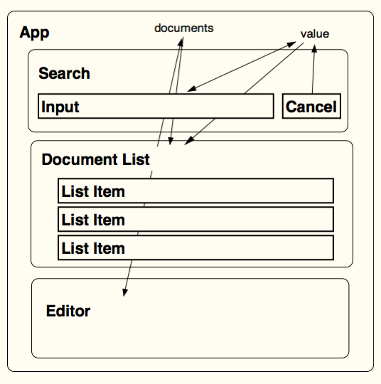

name: cover
class: center, middle, s-inverse, l-cover
layout: true

---

name: intro
tempalte: cover

# Facebook's React Library

## Chris Aquino, Big Nerd Ranch


---
name: bnr-logo
class: center, middle
layout: false


???
# Big Nerd Ranch

---
name: bnr-website
class:
layout: false

# Training *and* App Development


???
Two very different roles: training and app development for consulting

Always evaluating new * tools * libraries * frameworks *
And, always looking ahead


---

name: and-then-react
template: cover

# React

---

name: and-then-react
template: cover

# a haiku

---
template: cover
class: center

#functions declare view-<br>
#components, rendered virtually,<br>
#data swiftly flows


---
template: cover
# View Components

---

# React components

```js
  var MyComponent = React.createClass({


  });
```
---

# React components

```js
  var MyComponent = React.createClass({
    render: function() {

    }
  });
```

---
# React components

```js
  var MyComponent = React.createClass({
    render: function() {
      return React.DOM.h1(null, "Ni hao, react");
    }
  });
```

---
# React components

```js
  var MyComponent = React.createClass({
    render: function() {
      return React.DOM.h1(null, "Ni hao, react");
    }
  });
```
```js
  React.renderComponent(


  );
```

---

# React components

```js
  var MyComponent = React.createClass({
    render: function() {
      return React.DOM.h1(null, "Ni hao, react");
    }
  });
```
```js
  React.renderComponent(
    MyComponent()

  );
```
---
# React components

```js
  var MyComponent = React.createClass({
    render: function() {
      return React.DOM.h1(null, "Ni hao, react");
    }
  });
```
```js
  React.renderComponent(
    MyComponent(),
    document.getElementById('example')
  );
```


---
template: cover
# Components === Functions

---
template: cover

# Declarative UIs with JSX

---

# Would you rather write:

```js
var HelloMessage = React.createClass({
  render: function() {
    return (
      React.DOM.div(null,
        React.DOM.h1(null, "Greetings, Professor ", this.props.name,"."),
            React.DOM.p(null,
              "Would you like to play a game?",React.DOM.br(null ),
              "How about a nice game of",
              React.DOM.a( {href:"http://nsa.gov"}, "Chess"),"?"
            )
      )
    );
  }
});

React.renderComponent(HelloMessage( {name:"Professor Falken"} ), mountNode);
```

---
# Or this?

```js
var HelloMessage = React.createClass({
  render: function() {
    return (
      <div>
        <h1>Greetings, Professor {this.props.name}.</h1>
            <p>
              Would you like to play a game?<br />
              How about a nice game of
              <a href="http://nsa.gov">Chess</a>?
            </p>
      </div>
    );
  }
});

React.renderComponent(<HelloMessage name="Professor Falken" />, mountNode);
```
---

template: cover

#JSX transforms to functions

---

template: cover
# Virtual DOM

---

# Components !== DOM elements

## They only return *representations* of DOM elements

---

# In-memory DOM

.center[]


---

# Minimal set of DOM mutations
<br>
<br>
<br>
.center[]


???


these are just representations of DOM elements

everything happens in memory, and react figures out what needs to change via an efficient diffing algo

show a tree representing how react diffs

---

template: cover
# Reactive data flows


???

one way data flows, not binding

from parent to child component via "props"

and from child to parent via "states"

---

# Define components

.center[]

---

# Define components
.center[]

---

# Define data flows
.center[]

---
template: cover

# Speed

---
# The task
## Check and uncheck 1000 todos, 5 times

---

# Round 1: Backbone


--

# ~84s

---

# Round 2: Knockout.js


--

# ~45s

---

# Round 3: React


--

# ~270 ms


---

template: cover

# iCanHasReact?

---

# Use with other MVC frameworks

* Frameworks
  * Angular: [ngReact](http://davidchang.github.io/ngReact/)
  * Backbone: [backbone-react-component](http://magalhas.github.io/backbone-react-component/)
* Tooling
  * Gulp.js: [gulp-react](https://www.npmjs.org/package/gulp-react)
  * Grunt: [grunt-react](https://www.npmjs.org/package/grunt-react)


---

# Flux

.center[]


---

# Render from the Back End

* [react-rails](https://github.com/reactjs/react-rails)
* [django-reactify](https://github.com/petehunt/django-reactify)
* [react-php-v8js](https://github.com/reactjs/react-php-v8js)
* [node.js](https://github.com/facebook/react/tree/master/examples/server-rendering)


---

template: cover

# Learn more

---

# github.com/facebook/react
.center[]

???

Good example code

---


# facebook.github.io/react
.center[]

???

Videos and documentation

---

# github.com

## repo: radishmouse/atljs-react-talk

## branch: caquino/att-mobile-hackathon

---
name: outro
template: cover

# Thank you!

<br>
<br>

##Big Nerd Ranch

@bignerdranch

<br><br>

##Chris Aquino

@radishmouse
